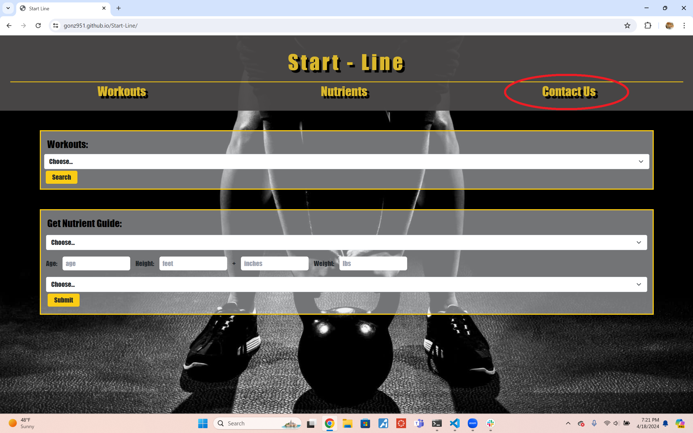
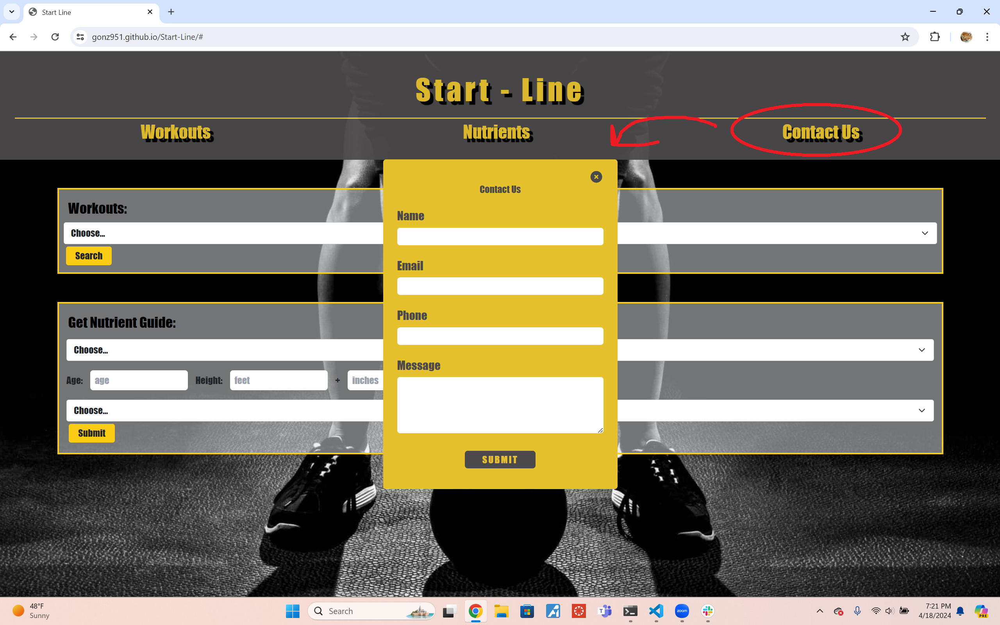

# Start-Line

## Description

This project was made with the idea of helping those new to the fitness world. It's anxiety-inducing to try something new without a starting point, so this website is meant to be that (the 'start-line'). 

## Table of Contents

- [Installation](#installation)
- [Usage](#usage)
- [Credits](#credits)
- [License](#license)

## Installation

No installation needed! Just the link: https://gonz951.github.io/Start-Line/

## Usage

The main page itself doesn't have much going on, however,
.png)

The 'Contact Us' button will present a modal

The modal itself takes in your name, email, phone, and an optional message to contact us. 

The 'workout' dropdown lets you pick whichever muscle you want to work on,
.png)

and will present workouts relevant to that part of the body
.png)

As for the nutrient's guide: The inputs will take in your information and use it to generate a guide. The guide itself will show you your estimated BMI, the calories you need per day, and nutrients you'll need.
.png)

## Credits

Credits mostly belong to the assignments in the UofU repo as reference. 

The exercise API: https://api-ninjas.com/api/exercises

The nutrition API: https://rapidapi.com/sprestrelski/api/nutrition-calculator/
